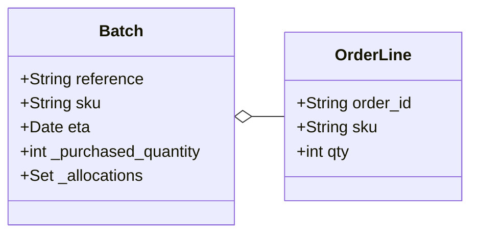

# ArchitecturePatterns
My companion Repo while I read Architecture Patterns with Python

# Domain Model

```mermaid
classDiagram
direction LR
class Batch {
    +String reference
    +String sku
    +Date eta
    +int _purchased_quantity
    +Set _allocations
}
class OrderLine {
    +String order_id
    +String sku
    +int qty
}

Batch o-- OrderLine
```    